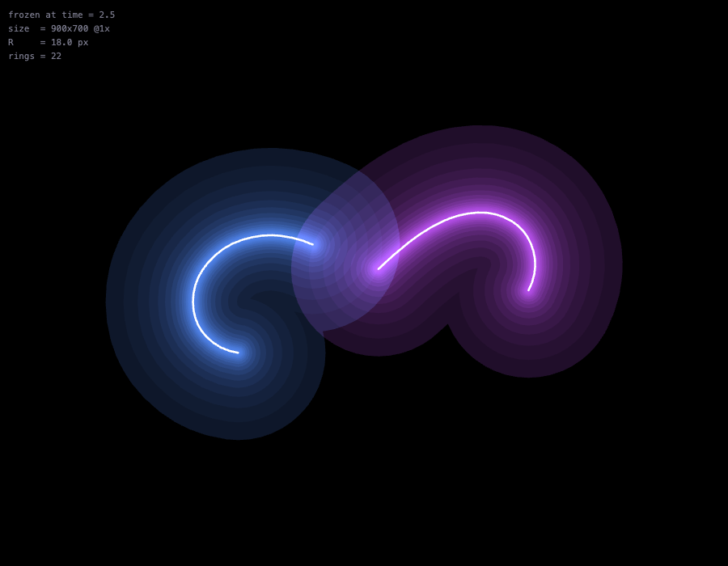
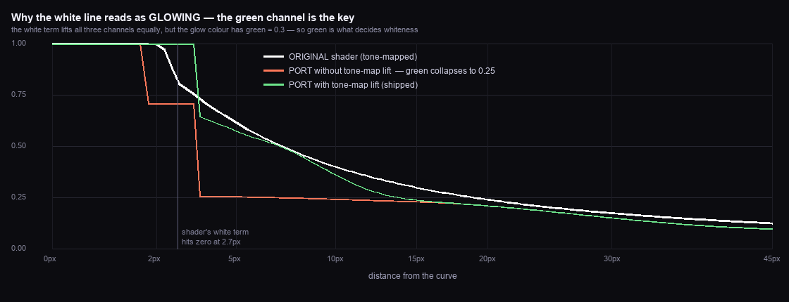
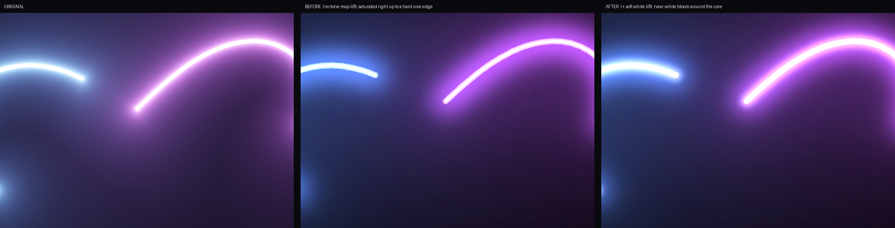
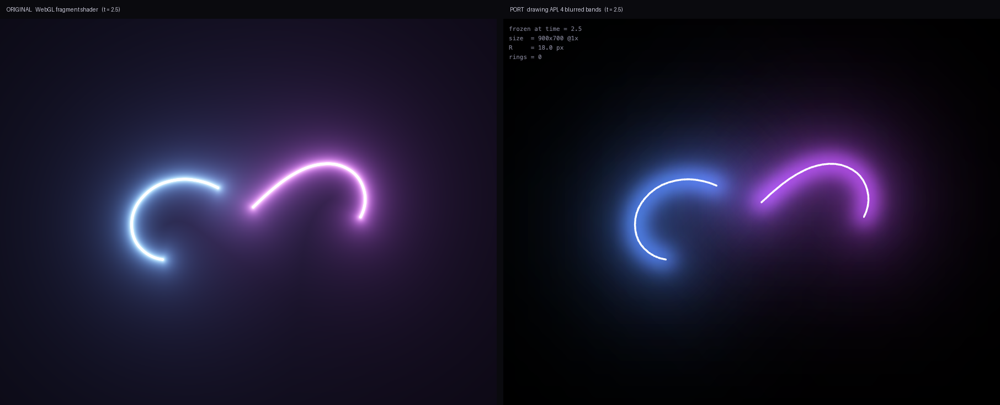
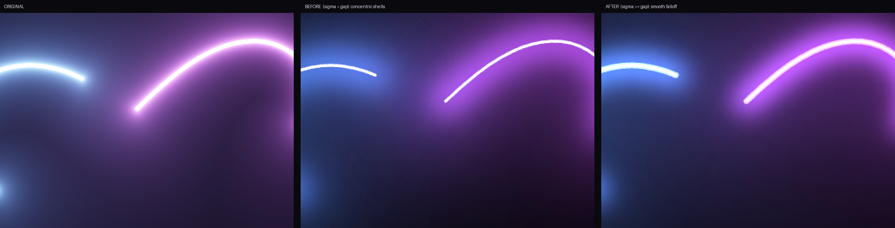
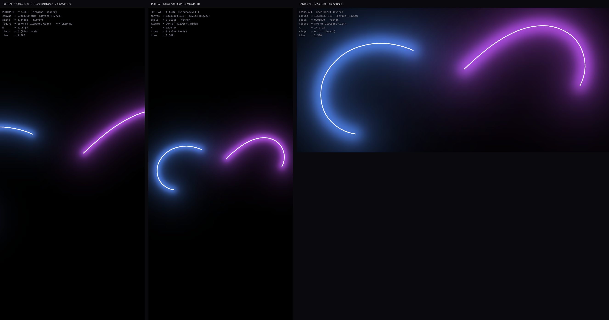

# Canvas 发光线条动画特效 → HarmonyOS NEXT 实现调研

> 调研对象：`~/Downloads/canvas发光线条动画特效/`（WebGL fragment shader 实现的"双色发光曲线"特效）
> 目标平台：HarmonyOS NEXT / OpenHarmony，ArkTS Stage 模型，API 12 ~ API 24
> 验证环境：DevEco Studio 6.1.1.125 · bundled SDK API 24 (`6.1.1.125`) · hvigor 6.24.4 · macOS

---

## 0. 结论（TL;DR）

**推荐路线：纯 ArkTS —— `@ohos.graphics.drawing`（ArkGraphics 2D）+ `DrawingRenderingContext` + `displaySync`，
零原生代码即可复刻该效果。**

| 决策点 | 结论 |
|---|---|
| 画布 | `Canvas(DrawingRenderingContext)`，`ctx.canvas` 直接拿到 `drawing.Canvas`（API 12+） |
| 发光 | `Pen.setMaskFilter(MaskFilter.createBlurMaskFilter(BlurType.SOLID, sigma))`（API 12+），4 条宽模糊带叠加 |
| 叠加 | `Pen.setBlendMode(drawing.BlendMode.PLUS)` = 12，即 `r = min(s+d, 1)`，真·加色混合（API 11+） |
| 曲线 | `Path.moveTo/quadTo`（API 11+） |
| 帧驱动 | `displaySync`（API 11+）。**ArkTS 没有 `requestAnimationFrame`** |
| 单位 | `new DrawingRenderingContext(LengthMetricsUnit.PX)` —— `drawing` 模块一律用 px |
| 需不需要写 C++？ | **不需要**。仅当要求与 shader 逐像素一致、或要跑满 120fps 时才上 XComponent + OpenGL ES |

**为什么不是 `CanvasRenderingContext2D`？** 官方图形概述明确写道：

> *"…due to the multi-layer encapsulation implementation, the Canvas component is not as close to the
> hardware as the Native Drawing Canvas. Therefore, in scenarios with high performance requirements,
> complex drawing, and strong hardware dependency … using the Canvas component for drawing may cause
> performance problems such as frame freezing and frame loss."*
> —— `research/raw/graphic-drawing-overview.md`

`CanvasRenderingContext2D` 是 W3C 兼容层，底层同样是 Native Drawing；而 `drawing` 模块直接暴露那一层，
并且提供了 2D context **没有**的 `BlendMode.PLUS`、`MaskFilter`、`ShaderEffect`。

**为什么不是声明式 `Shape`/`Path`？** `Shape.stroke()` 只接受 `ResourceColor`（纯色），渐变只能作用于填充区域，
无法做"沿描边的白热渐变 + 外发光"。

---

## 1. 原效果解析

### 1.1 它到底画了什么

不是"线条 + 后期辉光"，而是**逐像素的距离场（SDF）着色器**。核心三行（`script.js` 的 `main()`）：

```glsl
float dist = getSegment(t, pos, 0.0, scale);        // 到曲线的最短距离
float glow = getGlow(dist, radius, intensity);      // pow(radius/dist, 0.9)
col += 10.0 * vec3(smoothstep(0.003, 0.001, dist)); // 白热芯线
col += glow * vec3(0.7, 0.3, 0.9);                  // 紫色辉光
col  = 1.0 - exp(-col);                             // 色调映射
```

屏幕上的**每一个像素**，都要对 **2 条轨迹 × 7 段二次贝塞尔**求有符号距离——
原版把画布铺满整个窗口（`canvas.width = window.innerWidth`），
在 900×700 下就是每帧 63 万次 × 14 段贝塞尔求根——这就是它必须在 GPU 上跑的原因。

### 1.2 几何：双纽线（lemniscate）上滑动的 8 点链

```glsl
vec2 getLemniscatePosition(float t){
  float a = (1.0 + 0.5 + 0.5 * sin(t)) * 15.0;      // 宽度随参数变化 -> 路径"歪斜"
  return vec2((a*cos(t)) / (1.0 + sin(t)*sin(t)),
              (a*sin(t)*cos(t)) / (1.0 + sin(t)*sin(t)));
}
```

`getSegment()` 在参数轴上取 8 个采样点（步长 `len = 0.25`），
整体相位随 `fract(speed * t) * 6.28` 漂移（`speed = -0.7`），
再以相邻点中点 `mid(i,i+1)` 为锚、`points[i]` 为控制点串成一条二次贝塞尔链。

**⚠️ 原版有个 bug**：循环从 `i = 0` 开始，此时 `c = (points[0]+points[1])/2` 被重复计算，
于是第 0 段退化成 `sdBezier(mid01, P0, mid01)` —— 两个端点重合在中点、控制点甩到 P0，
在曲线上留下一根**尖刺**。原始截图中紫色轨迹尾部那道折角就是它。
本仓库的实现默认**不复现**该 bug（`INCLUDE_SPIKE = false`），需要"考古级还原"时置 `true`。

### 1.3 坐标映射（移植时最容易搞错的地方）

```glsl
vec2 uv  = gl_FragCoord.xy / resolution.xy;   // y 轴向上
vec2 pos = vec2(0.5, 0.5) - uv;
pos.y /= (resolution.x / resolution.y);       // 宽高比校正
float scale = 0.000015 * height;              // 图形尺寸跟高度走
```

推导后，曲线点 `S`（pos 空间）落在画布像素上：

```
x = W * (0.5 - S.x)          ← 注意 X 轴被镜像了
y = H * 0.5 + W * S.y
```

两个推论：

1. **X 镜像**：`pos.x = 0.5 - uv.x` 把图形水平翻转，轨迹的**行进方向与原版相反**。双纽线本身左右对称所以看不出来，但相位方向是反的。
2. **1 个 pos 单位 = W 个像素（x/y 都是）**。所以 `radius = 0.02` 换算成像素就是 `0.02 * W`——与 `H` 无关，
   而图形尺寸 `scale` 却跟 `H` 走。原版在横屏/竖屏下辉光半径与图形大小的比例会变，这是它的一个瑕疵；本实现保留了这个行为以便对齐。

---

## 2. 四条实现路线对比

| # | 路线 | 能否 1:1 还原 | 代码量 | 帧驱动 | 预览器 | 适用 |
|---|---|---|---|---|---|---|
| **1** | **`drawing` + `DrawingRenderingContext`** ⭐ | 视觉高度接近（矢量近似 SDF） | ~200 行 ArkTS | `displaySync` | ✅ 支持 | **推荐**，UI 级动效 |
| 2 | `CanvasRenderingContext2D` + `shadowBlur` | 一般，且性能最差 | ~80 行 | `displaySync` | ✅ | 快速原型 |
| 3 | 声明式 `Shape`/`Path` + `shadow()` | ❌ 描边无法渐变 | 最少 | `animateTo` | ✅ | 不推荐 |
| 4 | **XComponent + 原生 OpenGL ES** | ✅ **逐像素一致**（shader 可原样复用） | ~600 行 C++ + NAPI | `OH_DisplaySoloist` | ❌ **不支持** | 游戏级/120fps |

路线 4 的关键结论（详见 `research/xcomponent-opengl-research.md`）：

- 原 fragment shader 是 GLSL ES 1.0，**几乎可以原样搬到 OpenGL ES 3.0**（`attribute/varying` → `in/out`、`gl_FragColor` → 自定义 out 变量）。
- `XComponent({type: XComponentType.SURFACE, controller})` → `XComponentController.onSurfaceCreated` → `eglCreateWindowSurface`。
- **DevEco 预览器不支持 XComponent，也不支持调用 C++ 库**——必须真机/模拟器验证。
- ⚠️ `libraryname` 与 `XComponentController` 生命周期回调**互斥**：一旦设了 `libraryname`，ArkTS 侧的
  `onSurfaceCreated/Changed/Destroyed` 与全部触摸事件都不再触发。
- ⚠️ 渲染线程收尾有官方明确的崩溃陷阱：`NativeWindow` 必须在丢给子线程前
  `OH_NativeWindow_NativeObjectReference()`，或在 `OnSurfaceDestroyed` 里 `join()`；
  **绝不能**对它调 `OH_NativeWindow_DestroyNativeWindow()`。
  且 `OH_NativeXComponent_Callback` 被框架以**裸指针**保存，不能传栈上临时变量。

---

## 3. 推荐方案：关键 API 清单（均已对 SDK 声明核实）

| 用途 | API | `@since` |
|---|---|---|
| 直接绘制画布 | `DrawingRenderingContext` / `.canvas` / `.invalidate()` | 12 |
| 单位锁定 | `new DrawingRenderingContext(LengthMetricsUnit.PX)` | 12 |
| 加色混合 | `drawing.BlendMode.PLUS` (= 12)，`Pen.setBlendMode` | 11 |
| 外发光 | `MaskFilter.createBlurMaskFilter(BlurType, sigma)` | 12 |
| 描边 | `Pen.setColor(alpha, r, g, b)` / `setStrokeWidth` / `setCapStyle` / `setJoinStyle` | 12 / 11 / 12 / 12 |
| 路径 | `Path.moveTo` / `quadTo` / `reset` | 11 |
| 绘制 | `Canvas.attachPen(pen)` → `drawPath(path)` → `detachPen()` | 11 |
| 清屏 | `Canvas.drawColor(color, BlendMode.SRC)` | 11 |
| 帧时钟 | `displaySync.create()` / `.on('frame', cb)` / `.start()` / `.stop()` | 11 |
| 期望帧率 | `displaySync.setExpectedFrameRateRange({expected,min,max})` | 11 |

### 3.1 三个必须避开的坑

1. **`drawPath(path, pen)` 不存在。** SDK 里只有 `drawPath(path: Path): void` 一个重载；
   画笔要通过**先** `attachPen(pen)` 挂上去。这是最容易写错的一处。
2. **`Pen.setShadowLayer()` 只对文字生效。** 官方原文：*"The shadow layer effect takes effect only
   when text is drawn."* 名字很像"发光"，但它做不了线条辉光——要用 `MaskFilter`。
3. **`requestAnimationFrame` 在 ArkTS 里不存在。** 对 `component/`、`api/`、`kits/`、`arkts/` 全量 grep 零命中
   （唯一命中在 DevEco 自带 tsc 的 `lib.dom.d.ts`，那是 Web 类型声明，ArkTS 不暴露）。
   逐帧动画一律用 `displaySync`。

### 3.2 主循环（`GlowLemniscate/entry/src/main/ets/pages/Index.ets`）

```ts
private ctx: DrawingRenderingContext = new DrawingRenderingContext(LengthMetricsUnit.PX);
private sync: displaySync.DisplaySync = displaySync.create();

aboutToAppear(): void {
  this.sync.setExpectedFrameRateRange({ expected: 60, min: 30, max: 120 });
  this.sync.on('frame', () => { this.onFrame(); });
}

aboutToDisappear(): void {          // 必须：不停会泄漏
  this.running = false;
  this.sync.stop();
  this.sync.off('frame');
}

private onFrame(): void {
  this.time += TIME_STEP;                       // 0.015，与 shader 的 dt 一致
  this.renderer.render(this.surface!, this.time);
  this.ctx.invalidate();                        // 请求组件重绘
}

build() {
  Canvas(this.ctx).width('100%').height('100%')
    .onReady(() => { this.surface = this.ctx.canvas; this.refreshSize(); })
}
```

---

## 4. 核心难点：怎么用矢量图形做出 `pow(R/d, 0.9)` 的辉光

这是整个移植里唯一真正有技术含量的部分，也是本调研花时间最多的地方。

### 4.1 关键洞察：描边就是距离场

> **用宽度 `w` 描一条路径，覆盖的正好是"到路径距离 < w/2"的点集。**

也就是说 `stroke()` 天生就是 SDF 的等值线。于是：

```
value(d) = Σ { 所有 width/2 > d 的描边的 alpha }
```

只要把 alpha 取成目标衰减曲线的逐级差分，就能用 N 次描边逼近任意径向衰减。

### 4.2 但"环状阶梯"会严重 banding —— 实测

我按上面的思路做了 22 级几何递增的环（`preview/glow-twin.html?n=22`），
目标曲线 `T(d) = 1 - exp(-(R/d)^0.9)`：



结果**肉眼可见同心圆环**（上图：几何完全正确，但辉光变成了一张等高线图）。
原因是 `pow(R/d, 0.9)` 的尾巴极其平缓：相邻环之间的 alpha 增量只有 0.03~0.08，
而 8-bit sRGB 混合下这种小台阶在暗部非常显眼。
要平滑至少需要上百级——那是每帧 200+ 次宽描边，不划算。

所以 `GlowMode.RINGS` 在本工程里只作为对照实验保留，默认走下面这条路。

### 4.3 正确做法：几条"宽模糊带"

一条宽度 `w`、模糊 `sigma = s` 的描边，就是**矩形函数与高斯卷积**：

```
profile(d) = Q(d − w/2) − Q(d + w/2)        Q = 高斯的尾概率
```

即：`d < w/2 − 2s` 范围内是平的（alpha），跨过边缘滚降，到 `d ≈ w/2 + 2s` 归零。

**关键约束：`sigma` 必须 ≥ 到相邻带宽边缘的间距。**
否则每条带都以一个近似阶跃收尾，整个光晕就会退化成一圈圈同心"壳"。
这正是第一版的 bug（`sigma` = 0.9 / 1.8 / 3.0，而带宽间距是 1.5 / 3.0 / 4.5），
也是真机上"光晕和模糊太大"的真相：**不是辉光太宽，而是平的台阶 + 台阶之间硬边**。

修正后的表是针对 `T(d) = 1 − exp(−(R/d)^0.9)` 做**非负最小二乘拟合**（alpha 钳在 [0,1]）得到的：

| 带 | 宽度 | sigma | alpha | 滚降到 |
|---|---|---|---|---|
| inner | `1.6R` | `0.8R` | 1.000 | ~2.4R |
| | `2.7R` | `1.7R` | 0.077 | ~6R |
| | `4.8R` | `3.0R` | 0.319 | ~11R |
| ambient | `12.8R` | `8.0R` | 0.325 | ~22R |

| `d/R` | 0.5 | 1 | 1.5 | 2 | 3 | 4 | 6 | 8 | 10 | 14 |
|---|---|---|---|---|---|---|---|---|---|---|
| 目标 `T` | 0.845 | 0.632 | 0.501 | 0.415 | 0.311 | 0.250 | 0.181 | 0.143 | 0.118 | 0.089 |
| 拟合 | 0.815 | 0.732 | 0.562 | 0.406 | 0.288 | 0.251 | 0.187 | 0.146 | 0.119 | 0.074 |

- `d ≥ 2R` 段误差 ≤ 8.8/255；
- 相邻采样点最大台阶 **1.88/255**（旧表是 40~50/255）——**没有等高线**；
- `d ≤ 1R` 的误差（25/255）被白芯盖住，看不见。

> 用 `BlurType.NORMAL`（卷积整条描边），因为拟合用的就是"矩形⊗高斯"。
> 换 `SOLID` 会让每条带在边缘前保持满 alpha、只向外软化，等效于把每条带整体外移，
> 台阶会重新出现；`OUTER` 更会让带内完全透明，直接把台阶放大。

### 4.4 白芯宽度必须按画布宽度缩放

shader 是 `10.0 * smoothstep(0.003, 0.001, dist)`，其中 `dist` 是 **pos 空间**单位，
而 1 个 pos 单位 = `W` 像素。所以白芯宽度正比于**画布宽度**，不是一个固定像素数：

```
白色项 > 1.0（因而饱和为纯白）的范围 ≈ dist < 0.0026   →   全宽 ≈ 0.0052 · W
```

第一版把它硬编码成 `3.4 px`——那是按 W=900 调的，在 1216px 的手机上**不到正确宽度的一半**，
这就是真机上"白色线条太细"的原因。

| 画布宽 W | 旧（固定 3.4px） | 新（内芯 + 肩部） |
|---|---|---|
| 900 | 3.4 px | 3.1 + 6.8 px |
| 1216（手机） | 3.4 px | **4.3 + 9.1 px** |
| 2720 | 3.4 px | 9.5 + 20.4 px |

画成两条描边（内芯 + 更宽的低 alpha 肩部），对应 `smoothstep` 的软肩；
单条抗锯齿描边会是一条硬边线。

### 4.5 白线为什么看起来"在发光" —— 三个机制

这是整个效果最容易被误解的地方：**那条白线不是"画上去的白色"，而是"过曝"出来的**。
`drawImage` 式地描一条白线不会有这个观感。原版靠三件事叠加：

**机制 1：白芯被过驱动 10 倍。** `col += 10.0 * smoothstep(0.003, 0.001, dist)`
—— 不是 `1.0`，是 `10.0`。它远超显示上限，必须靠后面的色调映射压回来。

**机制 2：彩色辉光在近场也是过驱动的。** `pow(radius/dist, 0.9)` 在 `dist → 0` 时发散：
在 `d = 5px` 处（R = 18px）已经等于 3.4，在 `d = 2px` 处是 7.9。
也就是说**线附近的彩色辉光本身就是"过曝"的**，不需要白漆。

**机制 3：色调映射 `col = 1 - exp(-col)` 是软限幅器。** 这才是关键。
它把过驱动的值平滑压到 1：`10 → 0.99995`、`3 → 0.95`、`1 → 0.632`、`0.5 → 0.393`。
于是**即使白色项已经归零，只要彩色辉光还很大，三个通道就都接近饱和 → 呈现白色**：

| 距曲线 | 白芯项 | 紫辉光 | 合计 col | 色调映射后 | 观感 |
|---|---|---|---|---|---|
| 0 px | 10.0 | ∞ | — | (1.00, 1.00, 1.00) | 纯白 |
| 2.3 px | 1.3 | 6.37 | (5.7, 3.2, 7.0) | (1.00, 0.96, 1.00) | 仍然纯白 |
| **2.7 px** | **0.0** | **5.51** | (3.9, 1.7, 5.0) | (0.98, 0.81, 0.99) | **白色项已归零，看着还是白的** |
| 4.5 px | 0 | 3.48 | (2.4, 1.0, 3.1) | (0.91, 0.65, 0.96) | 淡紫白 |
| 9 px | 0 | 1.87 | (1.3, 0.6, 1.7) | (0.73, 0.43, 0.81) | 粉紫 |
| 18 px | 0 | 1.00 | (0.7, 0.3, 0.9) | (0.50, 0.26, 0.59) | 正紫 |

**看第 3 行**：几何上的白线在 2.7px 就结束了，但因为彩色辉光还有 5.5 的过驱动量，
色调映射让这一圈**看起来依然是白的**。所以原版的白线视觉宽度接近 **10px**，
远超它几何上的 5.4px。



绿通道最能说明问题：白芯项对三通道是等量的，而紫色辉光的绿系数只有 0.3，
所以**绿通道的高低直接决定"看起来白不白"**。白线 = 原版（绿通道一路贴到 1.0 再缓降）；
红线 = 没有色调映射补偿的矢量实现，绿通道在 3.4px 处**断崖式跌到 0.25**
—— 白线又细又硬，就是真机上"白色线条太细"的根因。

**机制在矢量实现里怎么补？** `BlendMode.PLUS` 是**硬限幅**（`min(s+d, 1)`），
而 `1 - exp(-x)` 是软限幅，两者在 1~3 这个区间差别最大。
所以补了一条**柔和的白色带**（`width = 0.70R`, `sigma = 0.20R`, `alpha = 0.55`），
它把三个通道**一起**抬起来 —— 这正是色调映射在做的事（去饱和）。

网格搜索拟合结果：`0..60px` 范围内三通道 RMS 误差从 **23.0/255 降到 9.5/255**，
`d = 2px` 处从 73/255 降到 **1/255**。

放大对比（左：原版 / 中：没有补偿 / 右：加了补偿）：



**还有一个必须遵守的细节：白芯必须用 `BlendMode.PLUS`，不能用 `source-over`。**
因为辉光已经把那圈混到饱和，再加白色才是 `min(1 + 颜色, 1) = 纯白`；
用 `source-over` 就只是"盖了一层白漆"，失去发光感。

**机制 4（感知层面）：加色混合让交叠处更亮。**
两条轨迹交叉、或辉光自交叠的地方，颜色是**相加**的（光的行为），
而不是"后画的盖住先画的"（颜料的行为）。这是人眼判断"这是光源"的重要线索。


---

## 5. 交付物

```
harmonyos-animation/
├── REPORT.md                       ← 本文
├── README.md                       ← 快速上手
├── GlowLemniscate/                 ← 可编译的 HarmonyOS NEXT 工程（已验证 BUILD SUCCESSFUL）
│   └── entry/src/main/ets/
│       ├── glow/GlowCurve.ets      ← shader 几何的纯函数移植（无 ArkUI 依赖，可单测）
│       ├── glow/GlowRenderer.ets   ← drawing API 渲染器（环形 / 模糊带两种模式）
│       └── pages/Index.ets         ← Canvas + displaySync 主循环
├── tools/
│   └── verify-geometry.mjs         ← 数值证明：移植的贝塞尔链与原 GLSL 逐点一致
├── preview/
│   ├── glow-twin.html              ← 渲染器的 HTML 孪生体：可在浏览器里看效果 + 量耗时
│   ├── original/                   ← 原 demo 的"时间冻结"副本（?t=1.23 定格对比）
│   └── frames/                     ← 对比截图
└── research/                       ← 深度附录（约 20 万字，100+ 引用源）
    ├── drawing-module-api-research.md    ← @ohos.graphics.drawing 逐 API 核实
    ├── neon-glow-pure-arkts.md           ← 纯 ArkTS 发光的方案审计（含被否方案）
    ├── xcomponent-opengl-research.md     ← XComponent + GLES 全流程 + 崩溃陷阱
    ├── arkui-visual-effects-audit.md     ← 声明式视觉效果能力审计
    └── raw/                              ← 103 份官方文档原文缓存
```

### 5.1 编译验证

```bash
cd GlowLemniscate
export DEVECO_SDK_HOME=/Applications/DevEco-Studio.app/Contents/sdk
export HVIGOR_USER_HOME=$PWD/../.hvigor-home      # 把 hvigor 缓存留在工作区内
/Applications/DevEco-Studio.app/Contents/tools/hvigor/bin/hvigorw --no-daemon assembleHap
```

实测输出：`BUILD SUCCESSFUL in 4 s 150 ms`（无 ArkTS 报错；未配签名，HAP 未签名属预期）。

### 5.2 几何正确性：数值验证 + 像素验证

**（a）数值验证。** `tools/verify-geometry.mjs` 把原 GLSL 的 `sdBezier` / `getSegment`
逐行转写成 JS 作为参考实现，再与移植侧的贝塞尔链在 160 万个采样点上比对：

```
$ node tools/verify-geometry.mjs
samples compared : 1600000
WITHOUT the original's degenerate i=0 segment:
  mismatching    : 538441
  max |ref-port| : 1.556e-2        (~14 px at W = 900)
WITH the degenerate i=0 segment (INCLUDE_SPIKE = true):
  mismatching    : 0
  max |ref-port| : 0.000e+0
PASS — the ported Bezier chain is numerically identical to the GLSL.
```

两个结论：移植的链与原 shader **完全等价**（`INCLUDE_SPIKE = true` 时逐点零误差）；
而那个退化段影响到 33% 的采样点、最大偏差约 14px —— 它就是原版曲线上那道尖刺。

**（b）像素验证。** `preview/glow-twin.html` 是 ArkTS 渲染器的逐行孪生体——同样的常量、
同样的坐标映射、同样的贝塞尔链，只是用 Canvas 2D 的 `'lighter'` 代替 `BlendMode.PLUS`
（两者底层都是 Skia）。在 `?t=2.5` 定格与原 demo 对比：



**几何逐点吻合**，配色与辉光层次一致；残差只在远场辉光的能量分布上——
原版是 `pow(R/d, 0.9)` 的解析长尾，矢量重建是 4 条高斯裙边的拟合。

放大对比（注意白芯粗细与光晕是否出现同心壳）：



- **ORIGINAL**：白芯粗、光晕连续；
- **BEFORE**（`sigma < 带宽间距`）：白芯明显偏细，光晕是一块**有硬边界的平坦色块**
  —— 真机上看到的"光晕和模糊太大"就是这个；
- **AFTER**（拟合表 + 按 W 缩放的白芯）：白芯饱满，光晕平滑衰减，无等高线。

---

## 6. 横竖屏适配

### 6.1 为什么竖屏看不全 —— 精确的成因

由 §1.3 的坐标映射可以推出一个反直觉的结论。图形的**屏幕像素半宽**是

```
halfWidth = W · scale · 22.906        (scale = 0.000015 · H)
          = 0.000015 · W · H · 22.906
```

而屏幕自身的半宽是 `W / 2`。两者相除，**W 被约掉了**：

```
halfWidth / (W/2) = 2 · 0.000015 · 22.906 · H = 6.8719e-4 · H
```

也就是说，**这个 shader 的取景只取决于视口高度 H（像素），与宽度、宽高比都无关**。
它只在 `H < 1455 px` 时才能装下整个图形：

| 设备 / 窗口 | 尺寸(px) | 溢出比 | 结果 |
|---|---|---|---|
| 手机竖屏 | 1260 × 2720 | **1.87×** | 左右各裁掉近一半，只能看到中间一段 |
| 手机横屏 | 2720 × 1260 | 0.87× | ✅ 完整可见 |
| 折叠屏展开·竖屏 | 1600 × 2560 | 1.76× | 被裁 |
| 折叠屏展开·横屏 | 2560 × 1600 | 1.10× | 仍被裁 10% |
| 平板横屏 | 2560 × 1600 | 1.10× | 仍被裁 10% |
| 普通桌面窗口 | 900 × 700 | 0.48× | ✅ 完整可见 |

这也解释了为什么这个 codepen 原版在桌面浏览器上好看、一到手机竖屏就"效果不理想"——
它**不是**分辨率无关的。竖屏看到的是被放大 1.87 倍后裁掉的画面中心，
所以既看不全图形，辉光的比例也失真。

### 6.2 配置：`module.json5`

```json5
// entry/src/main/module.json5 -> module.abilities[0]
"orientation": "auto_rotation",
```

可选值（取自 SDK 的 `toolchains/modulecheck/module.json` schema）：

| 值 | 含义 | 说明 |
|---|---|---|
| `auto_rotation` | 竖屏 / 横屏 / 横屏反向 / 竖屏反向 | **本项目采用**，最灵活 |
| `auto_rotation_landscape` | 只允许横屏两种朝向 | 跟随系统"旋转锁定"开关 |
| `landscape` | 只锁横屏正向 | **不受**系统旋转锁定影响，想强制横屏用这个 |
| `portrait` | 只锁竖屏 | 默认行为，本特效会被裁 |
| `unspecified` | 交给系统决定 | — |

另外两个配套改动：

**（a）全屏沉浸**（`EntryAbility.onWindowStageCreate`）——横竖屏下都多拿到状态栏与导航条的空间：

```ts
const win: window.Window = windowStage.getMainWindowSync();   // API 11+
win.setWindowLayoutFullScreen(true);                          // 画布延伸到系统栏之下
win.setWindowSystemBarEnable(['status']);                     // 只隐藏导航条，保留状态栏
```

**（b）旋转后重新测量**（`Index.ets`）——`auto_rotation` 下系统会重建窗口，
画布尺寸可能比 `onAreaChange` 晚一两帧才稳定，所以每帧读一次 `ctx.size` 兜底：

```ts
private onFrame(): void {
  ...
  this.refreshSize();     // 尺寸没变时只是两次数字读取，几乎零成本
  this.renderer.render(surface, this.time);
  this.ctx.invalidate();
}
```

### 6.3 顺带修掉竖屏与高分屏的裁切：`SizeMode.FIT`

横屏能解决问题，但为了竖屏和 2560×1600 这类高分屏也好看，`Viewport` 增加了一个钳制：

```ts
const fitX = FIT_MARGIN * 0.5 / LEMNISCATE_MAX_X;                      // 横向约束
const fitY = FIT_MARGIN * 0.5 * height / (width * LEMNISCATE_MAX_Y);   // 纵向约束
this.scale = Math.min(SHAPE_SCALE * height, fitX, fitY);
```

因为取的是 `min`，**FIT 只会把图形缩小，绝不会放大**——
在本来就装得下的窗口（多数横屏场景）里它与原 shader **完全一致、零回归**；
只在装不下时才收缩到 `FIT_MARGIN = 0.90` 的边距内。

想回到原版取景：`Index.ets` 里改成 `this.renderer.setSizeMode(SizeMode.SHADER)`。

三种取景的实测对比（`t = 2.5` 定格，各自按真机像素比例渲染）：



左：竖屏原版取景 → 图形左右溢出 1.87×；中：竖屏 `SizeMode.FIT` → 完整可见；
右：横屏 → 天然完整，且图形明显更大、辉光更舒展。

在浏览器里自己试：

```bash
# 竖屏·原版取景（会裁切）
open "preview/glow-twin.html?w=630&h=1360&devH=2720&fit=0&t=2.5"
# 竖屏·FIT
open "preview/glow-twin.html?w=630&h=1360&devH=2720&fit=1&t=2.5"
# 横屏
open "preview/glow-twin.html?w=1360&h=630&devH=1260&fit=1&t=2.5"
```

> `devH` 是"真机高度"，让小画布能忠实复现高分辨率手机的取景比例。

---

## 7. 性能与工程注意事项

| 事项 | 说明 |
|---|---|
| 画布尺寸 | Canvas 单边 > 8000px 官方文档标注会退化为 CPU 渲染，硬上限 10000px |
| 不可见时 | Canvas 的绘制指令队列在组件不可见时**仍会增长**；用 `setOnVisibleAreaApproximateChange`（API 13+）或直接 `sync.stop()` 兜住 |
| 不要 `renderGroup(true)` | 官方数据：会给逐帧辉光带来 77%→100% 的丢帧 |
| 模糊成本 | `MaskFilter` 比 `ImageFilter` 便宜；4 条模糊带的成本集中在最大的两条（`sigma = 3R` / `5R`，R = 画布宽度 × 0.02） |
| 线程 | 官方文档**从未**说明 Canvas 2D 或 drawing 模块跑在哪个线程——按 UI 线程设计，真机实测后再优化 |
| 内存 | `DisplaySync` 不 `stop()` 会泄漏；`MaskFilter` 用完 `pen.setMaskFilter(null)` 释放原生对象 |
| 120fps | 需要 `setExpectedFrameRateRange({expected: 120, ...})`，且系统不保证 |

**若帧率不达标**，按此顺序降级（先砍最贵、视觉影响最小的）：

1. 去掉 `far wash` 带（`w = 20R` / `sigma = 5R`，最贵的一条，只贡献最外围那圈淡淡的底光）；
2. 去掉 `ambient` 带（次贵），此时辉光半径缩到约 6R，仍像霓虹但不那么"糊"；
3. 把辉光层降分辨率离屏渲染再放大合成（标准 bloom 做法，成本线性下降）；
4. 切 `GlowRenderer.setMode(GlowMode.RINGS)` 并减少环数——省掉全部模糊，代价是轻微 banding；
5. 上路线 4（XComponent + GLES），用原 shader 逐像素计算。

---

## 8. 明确未验证 / 边界

诚实标注，避免误导：

- **未在真机或模拟器上运行过**（本机无连接设备，`hdc list targets` 为空）。编译通过 ≠ 运行时正确。
  首次上机时优先验证：`ctx.size` 在 `onReady` 时刻是否已就绪、`displaySync` 回调的实际帧率、
  `MaskFilter` 的模糊半径手感。
- **`drawing` 模块的线程模型无官方说明**，帧率数据需真机实测。
- `DrawingRenderingContext.size` 在 API 23 新增了 `unit` 属性；本项目在 API 12 基线用构造函数锁定 PX 单位。
- 原版 shader 用的 `6.28` 而非 `2π`（`6.28318…`），相位每圈有 0.05% 的跳变。本实现保留 `6.28` 以对齐。
- 声明式 `Shape` 的 `shadow()` 能否跟随描边轮廓，官方无文档说明，未验证。
- API 12 基线拿不到 `PathEffect.createDiscretePathEffect`（API 18）——想要"霓虹灯闪烁"效果需要 API 18+。

---

## 9. 一句话回答

> 用 **`DrawingRenderingContext` 拿到 `drawing.Canvas`**，把 shader 里的贝塞尔链用 `Path.quadTo` 画出来，
> 用 **四条 `BlurType.SOLID` 的宽模糊描边**在 **`BlendMode.PLUS`** 下叠加重建 `pow(R/d, 0.9)` 的长尾辉光，
> 再压一条白芯，用 **`displaySync`** 驱动 —— 全部 ArkTS，无需一行 C++，工程已编译通过。
> 只有要求逐像素一致时才需要 XComponent + OpenGL ES 原样搬运 shader。
